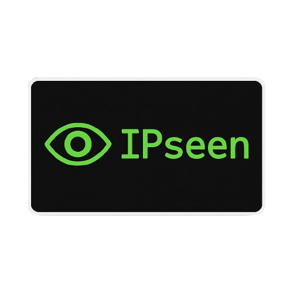

<div align="center">
 
   <br>
  
  
  
</div>

<br>
<br>

##  <p align="center">📋 Overview</p>

**IPseen** is your command-line companion to effortlessly obtain your network identity. <br><br> Through IPseen you can have instant access to your:

- **Public IP** — Your device’s internet identifier.
- **Private IP** — Your device’s local network identifier. 
- **MAC Address** — Your device’s unique hardware address.
  
<br>
<br>

## <p align="center">⚙️ How to Use IPseen</p>

### <p align="center">💻 Commands</p>

> **💡 Help**  
> Display the full list of commands:  
> ```
> IPseen --help
> ```

> **🛠️ Version**  
> Check your installed version:  
> ```
> IPseen --version
> ```

> **🌐 IPseen**  
> Display your Addresses:  
> ```
> IPseen
> ```

> **🌍 Public IP**  
> Display your Public IP:  
> ```
> IPseen --public
> ```

> **🏠 Private IP**  
> Display your Private IP:  
> ```
> IPseen --private
> ```

> **🧬 MAC Address**  
> Display your MAC address:  
> ```
> IPseen --mac
> ```

<br>
<br>

---

<br>
<br>

## <p align="center">📥 Installation</p>

Start by cloning the repository:
```
git clone https://github.com/paolonavatta/IPseen.git
```

Navigate into your OS-specific directory (`Windows` or `Linux`).

<br>

### Windows

- Open **PowerShell** with Administrator privileges (choose **Run as administrator**)
- Navigate to the `Windows` folder
- Run the installer script:
  
  ```powershell
  ./installer.ps1
  ```
<br>
<br>

### Linux

- Open **Bash**
- Navigate to the `Linux` folder
- Make the installer script executable:

  ```bash
  chmod +x installer.sh
  ```
  
- Run the installer script with Administrator privileges (use `sudo`):
  
  ```bash
  sudo ./installer.sh
  ```

---

<br>
<br>


## <p align="center">📄 License</p>

IPseen is licensed under the [**Apache License 2.0**](./LICENSE). You are free to use, modify, and distribute the software, provided that you include proper attribution, attach a copy of the license in any redistribution, and do not use the trademarks of the original project without permission. For full details, please refer to the LICENSE file included with this project.
